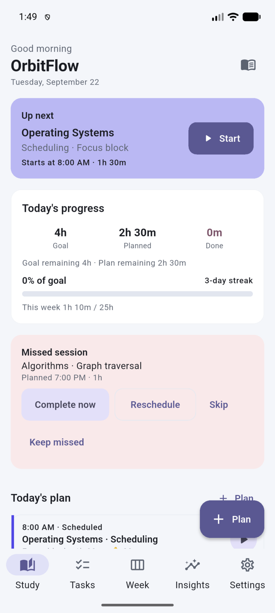
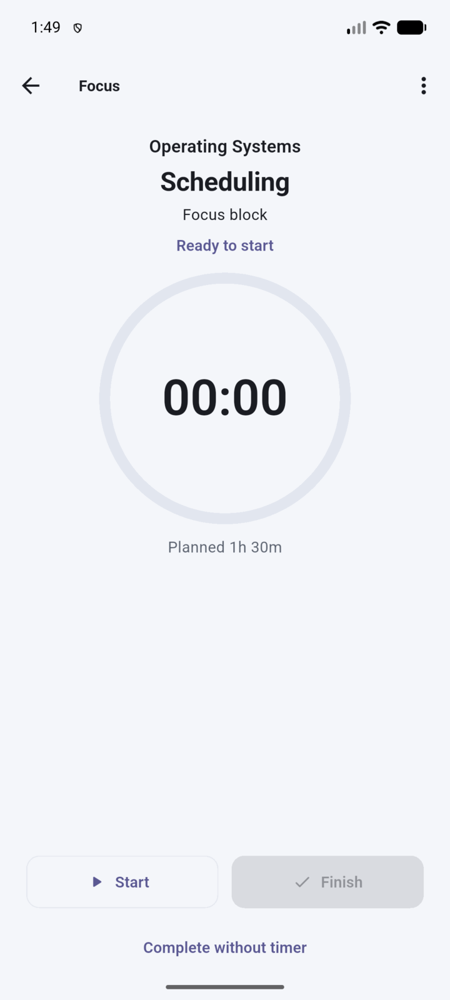
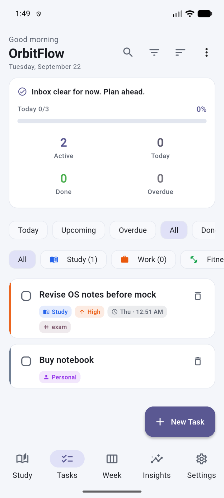
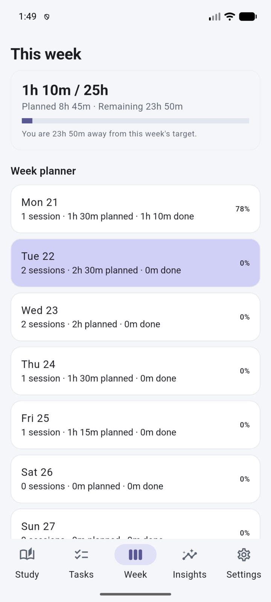
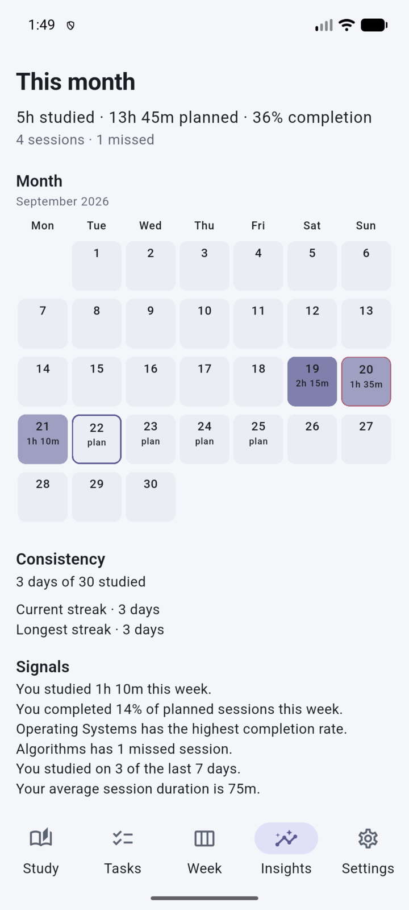
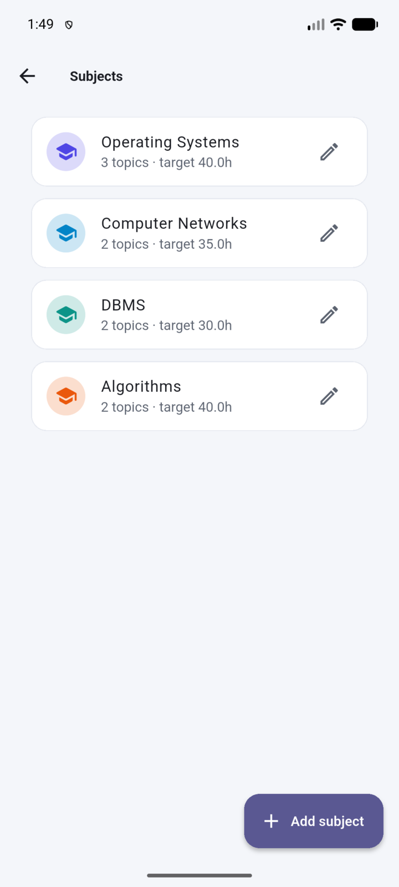
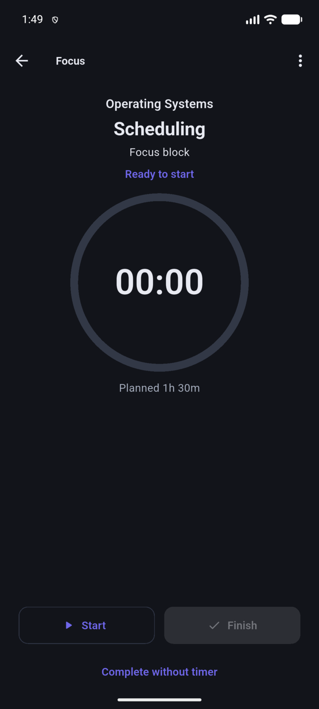
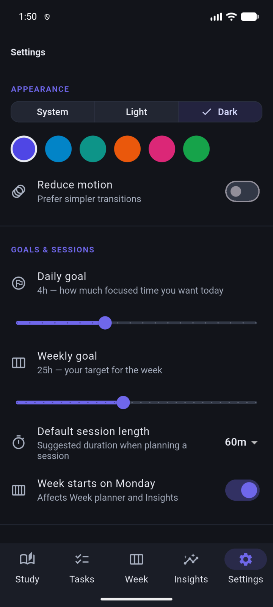

<div align="center">

# OrbitFlow

### Personal Productivity & Study OS

**Plan. Focus. Complete. Improve.**

OrbitFlow combines study planning, focus sessions, tasks, reminders, and progress tracking in one offline-first productivity app.

[](https://flutter.dev)
[](https://dart.dev)
[](#platform-status)
[](#quality)

**[Download Android APK](https://github.com/anandr-git/orbitflow/releases/latest)** · [Features](#features) · [Experience](#experience-orbitflow)

</div>

---

## Download

**[Download the latest Android APK](https://github.com/anandr-git/orbitflow/releases/latest)**

Validated on Android phone and Pad-class tablet layouts.

---

## Why OrbitFlow?

Most people juggle a planner, a to-do list, a timer, and notes. OrbitFlow keeps those pieces together as one personal productivity system.

```text
Plan → Schedule → Get reminded → Focus → Complete → Review → Improve
```

## Built for

**Students** — study plans, subjects, focus sessions, progress.  
**Professionals** — tasks, deadlines, projects, focused work.  
**Hybrid users** — work + learning in one system.

---

## Features

| Study | Productivity |
|---|---|
| Subjects & topics | Tasks & priorities |
| Study sessions | Deadlines |
| Focus mode | Search / filters |
| Goals & streaks | Recurring tasks |
| Progress insights | Subtasks |

| Planning | Notifications |
|---|---|
| Today | Session reminders |
| Week | Start alerts |
| Day agenda | Missed-session alerts |
| Monthly insights | Quiet hours |

Light / dark / system themes · accent colors · local backup import/export

---

## Experience OrbitFlow

A quick look at the main workflows (sample preview data).

### Study & Productivity

<table>
  <tr>
    <td align="center" width="50%">
      <strong>Study Dashboard</strong><br><br>
      
    </td>
    <td align="center" width="50%">
      <strong>Focus Mode</strong><br><br>
      
    </td>
  </tr>
  <tr>
    <td align="center" width="50%">
      <strong>Task Management</strong><br><br>
      
    </td>
    <td align="center" width="50%">
      <strong>Weekly Planning</strong><br><br>
      
    </td>
  </tr>
  <tr>
    <td align="center" width="50%">
      <strong>Insights</strong><br><br>
      
    </td>
    <td align="center" width="50%">
      <strong>Subjects & Topics</strong><br><br>
      
    </td>
  </tr>
</table>

### Dark Mode

<table>
  <tr>
    <td align="center" width="50%">
      <strong>Study</strong><br><br>
      
    </td>
    <td align="center" width="50%">
      <strong>Focus</strong><br><br>
      
    </td>
  </tr>
  <tr>
    <td align="center" width="50%">
      <strong>Insights</strong><br><br>
      
    </td>
    <td align="center" width="50%">
      <strong>Settings</strong><br><br>
      
    </td>
  </tr>
</table>

---

## Development

```bash
git clone https://github.com/anandr-git/orbitflow.git
cd OrbitFlow
flutter pub get
flutter run
```

```bash
flutter analyze && flutter test
flutter build apk --release
```

---

## Platform Status

| Platform | Status |
|---|---|
| Android phone | Validated |
| Android tablet | Validated |
| Web | Smoke-tested |
| Linux | Build validated |
| Windows / macOS / iOS | Not yet tested |

[Platform matrix →](docs/PLATFORM_MATRIX.md) · [Architecture →](docs/ARCHITECTURE.md) · [Privacy →](docs/SECURITY_AUDIT.md)

---

## Quality

- `flutter analyze` — clean
- `flutter test` — 27/27 passed
- Android release APK + tablet layout validated

[Release test report →](docs/RELEASE_TEST_REPORT.md)

## Roadmap

Richer desktop layouts · deeper calendar planning · broader cross-platform validation · more productivity workflows

## Contributing

Fork → branch → change → test → PR. Preserve offline-first behavior.

## License

License: **not yet specified**
