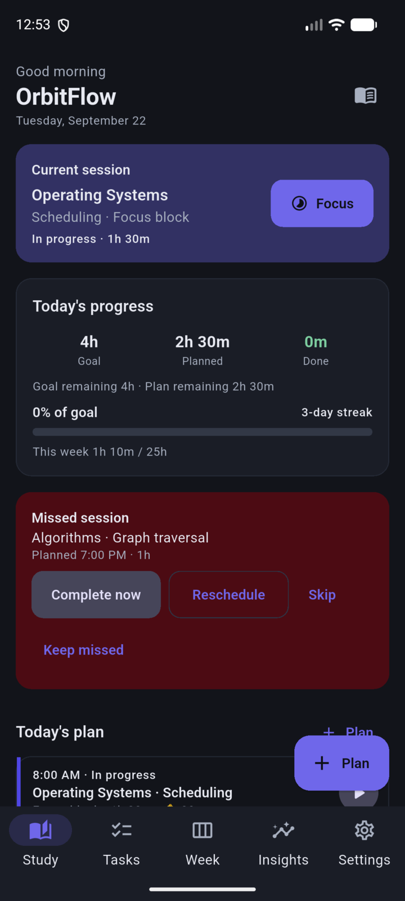
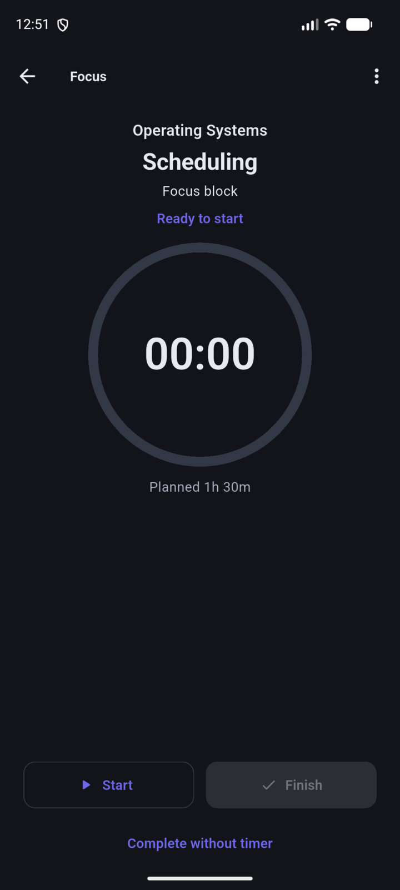
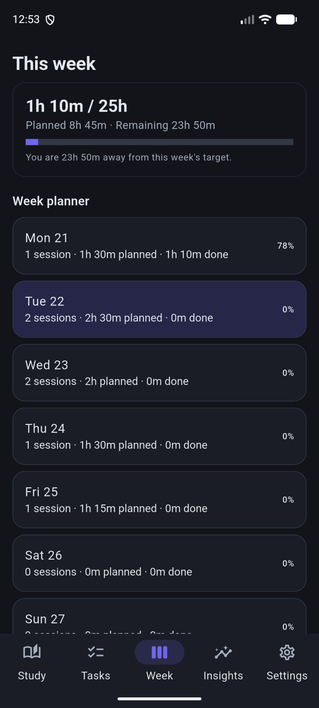
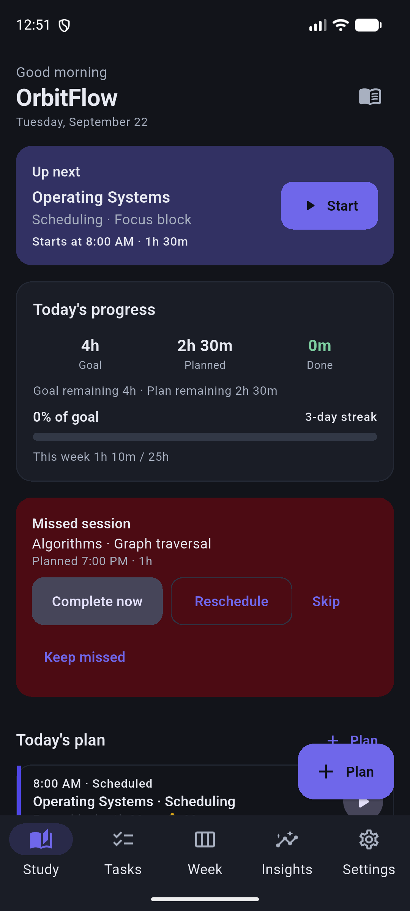

<div align="center">

# OrbitFlow

### Personal Productivity & Study OS

**Plan your study, organize your work, focus deeply, and understand your progress — all in one offline-first productivity app.**

[](https://flutter.dev)
[](https://dart.dev)
[](#platform-status)
[](#testing)
[](#license)

[Download Android APK](https://github.com/anandr-git/orbitflow/releases/latest) · [Features](#features) · [Quick Start](#quick-start) · [Architecture](#architecture)

</div>

---

OrbitFlow is a Flutter app that brings **study planning**, **focus sessions**, **tasks**, **reminders**, **weekly planning**, and **progress insights** into one coherent workflow. It is built for students, professionals, and hybrid users — not a study-only tool.

---

## The OrbitFlow Loop

```text
Plan → Schedule → Get reminded → Focus → Complete → Review progress → Improve the next plan
```

OrbitFlow turns planning into an ongoing loop: schedule focused blocks, execute them with Focus mode, recover missed sessions, then use Insights to tighten the next plan. Tasks sit alongside study so work and learning share one system.

---

## Features

### Study

- Subjects & topics
- Study sessions (duration, reminders, recurrence)
- Focus mode (start / pause / resume / finish)
- Pomodoro-friendly timed blocks
- Daily & weekly goals
- Streaks
- Progress analytics
- Missed-session recovery (complete, reschedule, skip)

### Productivity

- Tasks with priorities & categories
- Deadlines
- Search, filters & sorting
- Archive
- Recurring tasks
- Subtasks on task details

### Planning

- Today dashboard
- Week planner
- Day agenda
- Monthly insights
- Up Next
- Planned vs actual

### Notifications

- Session reminders
- Start-time alerts
- Missed-session alerts
- Evening summaries
- Quiet hours

### Personalization

- Light / Dark / System theme
- Accent colors
- Reduce motion
- Onboarding focus: Study · Work · Study + Work · Personal

### Data

- Offline-first local persistence
- JSON import / export backup
- Optional sample preview data (confirm-gated; not real history)

---

## Who is it for?

### Students

- Exam preparation
- Subject & topic tracking
- Study schedules
- Consistency & revision streaks

### Professionals

- Work tasks & deadlines
- Project planning
- Focus blocks
- Learning & certifications

### Hybrid users

- Work during the day
- Study in the evening
- One productivity system for both

OrbitFlow is **not only a study app** — Tasks are a first-class surface beside Study, Week, and Insights.

---

## Experience OrbitFlow

Screenshots use **sample / preview data** for demonstration. They are not real user history.

### Study Dashboard

Today’s plan, progress toward goals, current/up-next session, and missed-session recovery in one place.



### Focus Mode

Timed focus blocks with start / finish controls for deep work sessions.



### Tasks

Priorities, categories, filters, and a clear task inbox for study and personal work.


### Week Planning

Week-level planned vs done progress across each day.



### Insights

Monthly calendar heat, consistency streaks, and actionable signals.


### Subjects & Topics

Track subjects with topic counts and hour targets.


### Dark Mode

OrbitFlow’s dark theme across the Study experience.



Additional captures (tablet metrics, notification shade, intermediate QA) live under `docs/screenshots/testing/`.

---

## Install on Android

**Latest release:** [OrbitFlow v3.1.0 on GitHub Releases](https://github.com/anandr-git/orbitflow/releases/latest)

1. Download `OrbitFlow-Android.apk` from the [latest GitHub Release](https://github.com/anandr-git/orbitflow/releases/latest).
2. Open the APK on your Android phone or tablet.
3. Allow installation from that source when Android prompts you.
4. Launch **OrbitFlow**.

No root or unsafe sideload bypasses are required — use the normal Android install flow for unknown apps from a trusted release page.

SHA-256 of the current Android APK:

`d50169ebb6d1ae72f3a3abf73a405012c3a07beecdd7638116ca42ba6f4f348a`

---

## Quick Start

For developers:

```bash
git clone https://github.com/anandr-git/orbitflow.git
cd OrbitFlow
flutter pub get
flutter run
```

Quality checks:

```bash
flutter analyze
flutter test
```

---

## Build from Source

```bash
flutter pub get
flutter analyze
flutter test
flutter run
```

Release APK (Android — validated on this project):

```bash
flutter build apk --release
mkdir -p dist
cp build/app/outputs/flutter-apk/app-release.apk dist/OrbitFlow-Android.apk
sha256sum dist/OrbitFlow-Android.apk
```

---

## Platform Status

| Platform | Status |
|----------|--------|
| Android phone | Validated |
| Android tablet | Validated (Pad-class metrics) |
| Web | Builds; smoke-tested (limitations, esp. notifications) |
| Linux | Builds; interactive QA limited |
| Windows | Source present — not tested |
| macOS | Source present — not tested |
| iOS | Source present — not tested |

Details: [`docs/PLATFORM_MATRIX.md`](docs/PLATFORM_MATRIX.md) · [`docs/RELEASE_TEST_REPORT.md`](docs/RELEASE_TEST_REPORT.md)

---

## Architecture

```text
lib/
├── analytics/     # Study analytics & insights helpers
├── data/          # Demo / sample preview data
├── models/        # Subjects, sessions, todos, settings
├── screens/       # Study, Tasks, Week, Insights, Focus, Settings, …
├── services/      # Local notifications
├── state/         # OrbitController (app state)
├── storage/       # SharedPreferences-backed persistence
├── theme/         # Material 3 themes & design tokens
├── utils/         # Date, query, responsive helpers
├── widgets/       # Shared UI pieces
└── main.dart
```

Platform folders: `android/`, `ios/`, `linux/`, `macos/`, `windows/`, `web/`.

---

## Privacy & Data

OrbitFlow is **offline-first**. Sessions, tasks, subjects, and settings are stored locally (currently via `SharedPreferences` JSON).

- **Export** copies a JSON backup to the clipboard.
- **Import** replaces local data from a pasted backup (validated).
- There is **no OrbitFlow cloud account** in the current build.
- Local notifications stay on-device.
- Release APKs do not declare `INTERNET` for app features (debug tooling may differ).

“Offline-first” is a product design choice, not a formal security certification. See [`docs/SECURITY_AUDIT.md`](docs/SECURITY_AUDIT.md).

---

## Testing

Verified on the release-prep host:

```text
flutter analyze   → clean
flutter test      → 27/27 passed
```

Also validated:

- Android release APK install & launch (Pixel_8 emulator)
- Android tablet layout metrics

No CI workflows are claimed in this repository yet.

---

## Roadmap

Realistic next directions:

- Expanded cross-platform validation (desktop / iOS)
- Richer desktop layouts
- More planning views
- Additional productivity workflows

---

## Contributing

1. Fork the repository
2. Create a feature branch
3. Make focused changes
4. Run `flutter analyze` and `flutter test`
5. Open a pull request

Please preserve offline-first behavior and avoid committing build artifacts, keystores, or secrets.

---

## License

License: **not yet specified**

---

## Compatibility note

The visible product name is **OrbitFlow**. For install continuity, the Android `applicationId` remains `com.example.my_first_testing_app` until a deliberate package-id migration is planned.
